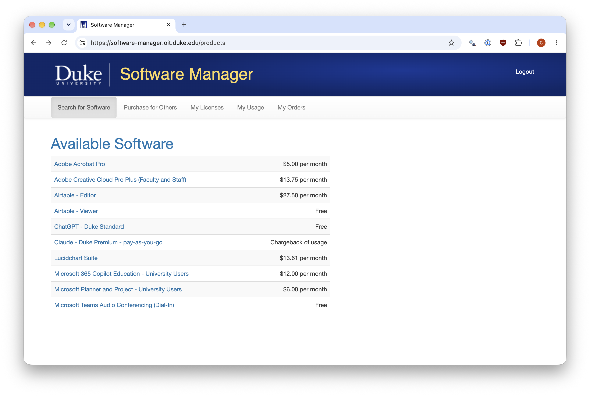
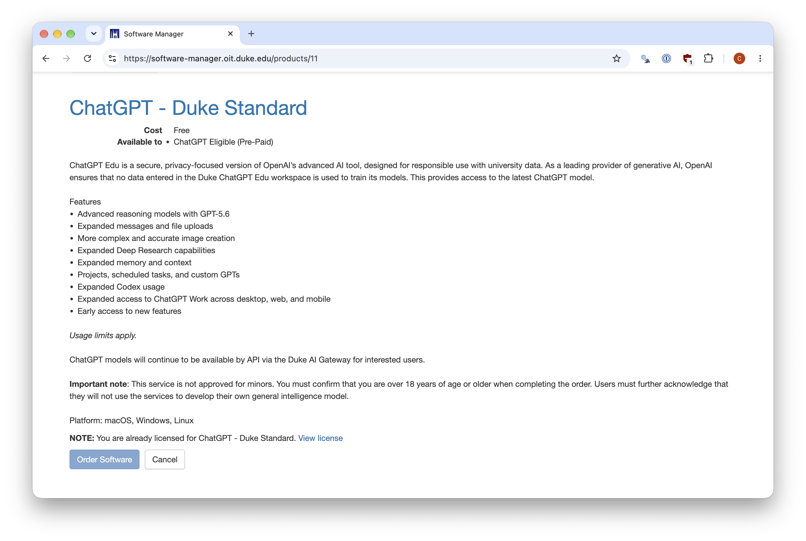
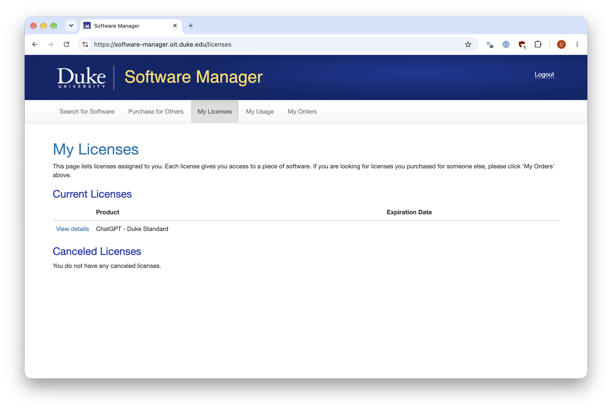

# Duke ChatGPT Edu Guide

This is a brief guide for obtaining the no-cost **ChatGPT - Duke Standard**
license through Duke's Software Manager and signing in with Duke Shibboleth.

## What the license provides

The license provides a Duke-managed ChatGPT Edu account with capabilities
comparable to a personal ChatGPT Plus account. These include:

* ChatGPT with advanced reasoning models, expanded messages and file uploads,
  image creation, voice, memory, and Deep Research.
* Projects, scheduled tasks, and custom GPTs.
* Codex for software-development tasks.
* ChatGPT Work on the web, desktop, and mobile applications.

Usage limits apply. OpenAI does not use data entered in the Duke workspace to
train its models. The service may be used with Duke sensitive and protected
data, but **not Protected Health Information (PHI)**. It is not available for
Duke Health or Duke Kunshan University. See the [Duke ChatGPT Edu service
page](https://oit.duke.edu/service/chatgpt-edu/) for current restrictions.

The license does not include API access. For programmatic access to models, use
Duke's [AI Gateway](https://oit.duke.edu/service/ai-gateway/).

### ChatGPT Pro access

Duke OIT now offers discounted ChatGPT Pro licenses for users who need more
capacity for Duke-affiliated work. The Duke Pro license costs **$100 per
month** and is equivalent to OpenAI's commercial ChatGPT Pro plan, which is
normally $200 per month. It is ordered through [Duke Software
Manager](https://software-manager.oit.duke.edu/products/32) in the same way as
the Standard license (see below), except that the order requires a Duke **fund
code**.

Pro accounts live in a separate workspace from the Standard account. After
signing in, switch between the two workspaces from the ChatGPT profile menu or
account settings. See the [Duke ChatGPT Edu service
page](https://oit.duke.edu/service/chatgpt-edu/) for current details.

## Obtain the license

You will need an eligible Duke NetID, access to multi-factor authentication,
and must be at least 18 years old.

1. Open [Duke Software Manager](https://software-manager.oit.duke.edu/) and log
   in with your NetID using Duke Shibboleth.

2. On the **Search for Software** page, select **ChatGPT - Duke Standard**. It
   should be listed as **Free**.

   

3. Review the product description and select **Order Software**.

   

4. Accept the terms, including the age and usage confirmations, and complete
   the order. The Standard license does not require a fund code; the Pro
   license does.

5. Open **My Licenses** and confirm that **ChatGPT - Duke Standard** appears
   under **Current Licenses**.

   

If **Order Software** is disabled and the page says that you are already
licensed, no further order is needed. New licenses may take a few minutes to
appear. See Duke's general [Software Manager ordering
instructions](https://oit.duke.edu/help/articles/kb0035630/) for more details.

## Sign in with Duke Shibboleth

Once the license appears under **My Licenses**:

1. Go to [chatgpt.com](https://chatgpt.com/) and select **Log in**.

2. Enter **`netid@duke.edu`**, replacing `netid` with your NetID. Use this
   address even if you normally use a different Duke email alias.

3. Select **Continue with SSO**. ChatGPT will redirect you to Duke's
   Shibboleth login page. Enter your NetID credentials and complete
   multi-factor authentication.

4. Complete any onboarding prompts, then use the profile menu to confirm that
   you are in the Duke-managed workspace.

## Connect Codex

Codex is included with the Duke Standard license and can be used from the
desktop app, command line, or an editor. In each client, choose **Sign in with
ChatGPT** rather than an API key. The client will open a browser; enter
`netid@duke.edu`, select **Continue with SSO**, complete Duke Shibboleth
authentication, and confirm that the Duke workspace is selected.

### Desktop app

[Download the ChatGPT desktop app](https://learn.chatgpt.com/docs/app) for
macOS, Windows, or Linux. Open it, select **Continue** to sign in, and complete
the SSO flow in your browser. Choose **Codex**, open a project folder, and start
a new chat.

### Command-line interface

Install the [Codex CLI](https://learn.chatgpt.com/docs/codex/cli), then run:

``` shell
codex login
```

Choose **Sign in with ChatGPT** and complete Duke SSO in the browser. You can
then open a project directory and start Codex with:

``` shell
codex
```

### VS Code and other editors

Install the [Codex IDE extension](https://learn.chatgpt.com/docs/codex/ide) in
VS Code, Cursor, or Windsurf. Open the Codex sidebar and select **Sign in with
ChatGPT**. If the sidebar is hidden, open the Command Palette and run **Codex:
Open Codex Sidebar**. Xcode and JetBrains IDEs provide their own Codex
integrations; select Codex as the agent and use the same Duke SSO account.

The CLI and IDE extension share cached login information. See OpenAI's
[authentication documentation](https://learn.chatgpt.com/docs/auth) if the
wrong account or workspace is selected.

## Existing ChatGPT accounts

If you already have a personal ChatGPT account registered as
`netid@duke.edu`, OpenAI may ask you either to transfer its chats and GPTs into
the Duke workspace or to export its data and begin with an empty Duke
workspace. This migration cannot be undone, so [export and verify your
data](https://help.openai.com/en/articles/7260999-how-do-i-export-my-chatgpthistory-and-data)
before proceeding. OpenAI should cancel an associated paid personal
subscription, but confirm its status and any app-store billing after migration.

A personal ChatGPT account registered to a non-Duke address remains separate
and does not need to be migrated.

## Troubleshooting

* If the license does not appear, refresh **My Licenses** after a few minutes.
* If ChatGPT does not redirect to Duke Shibboleth, sign out and begin again with
  the exact `netid@duke.edu` address. A private browser window may help.
* If the Duke workspace or existing history is missing, check the selected
  account and workspace in the profile menu. Do not create another account to
  work around an SSO mismatch.
* For continued problems, contact the [Duke OIT Service
  Desk](https://oit.duke.edu/help/) or call **919-684-2200**.

Access remains tied to your eligible Duke affiliation. Save any material you
are permitted to retain before leaving Duke; [student access ends when student
affiliation is removed](https://oit.duke.edu/help/articles/kb0023279/).

## Additional resources

* [Duke OIT: ChatGPT Edu](https://oit.duke.edu/service/chatgpt-edu/)
* [Duke OIT: Software Manager instructions](https://oit.duke.edu/help/articles/kb0035630/)
* [Duke AI Support and Training Hub](https://hub.ai.duke.edu/)
* [OpenAI: SSO and workspace troubleshooting](https://help.openai.com/en/articles/10489721-troubleshooting-sso-workspace-access-and-domain-verification)
